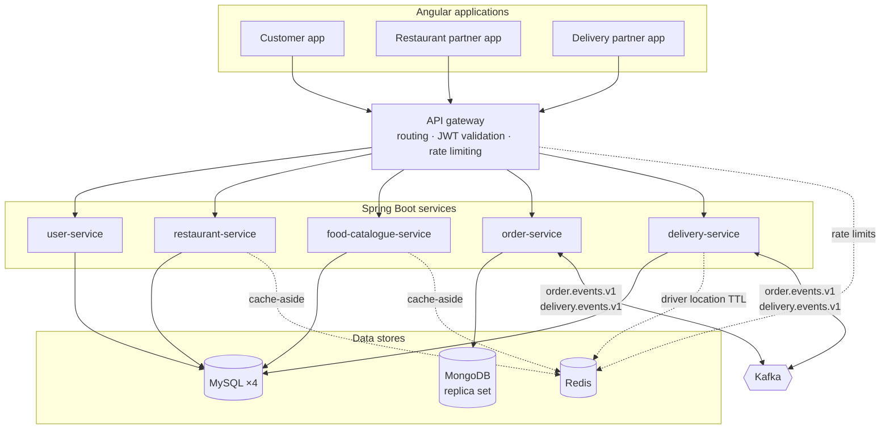
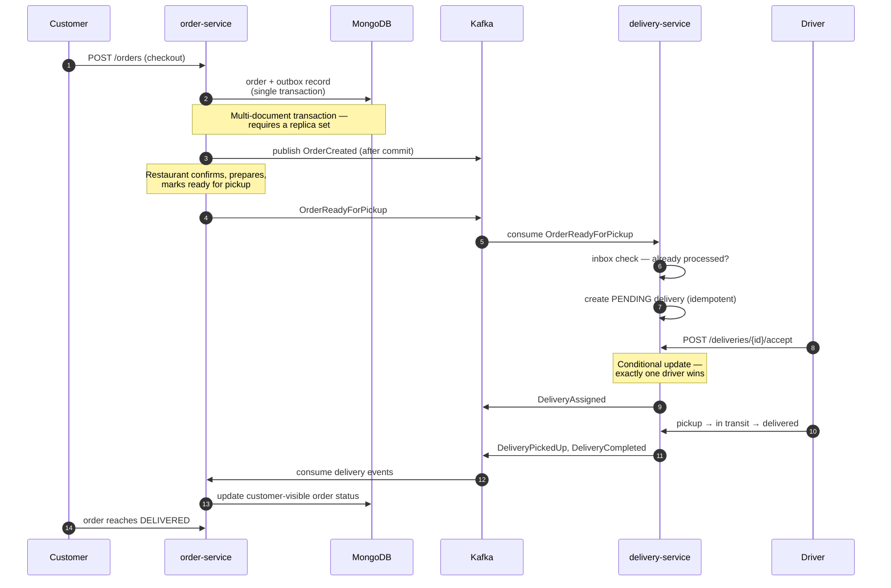

# Food Delivery Platform

An event-driven food delivery platform built as a distributed system: seven Spring Boot services, three Angular applications, and a Kafka event backbone, deployed across three cloud providers for roughly $5/month.

The interesting parts are not the CRUD — they are the transactional outbox/inbox pattern that makes the order-to-delivery workflow exactly-once from the application's perspective, the ownership-based authorization model, and a deployment topology chosen under a real cost constraint.

---

## Live demo

| Application | URL |
|---|---|
| Customer app | https://food-delivery-ui-n8c3.onrender.com |
| Restaurant partner app | https://partner-app-65z2.onrender.com |
| Delivery partner app | https://delivery-app-csdw.onrender.com |
| API gateway | https://api-gateway-3nle.onrender.com |

> **Cold starts.** Every service runs on Render's free tier, which spins instances down after 15 minutes of inactivity. The first request after an idle period can take 60–90 seconds, and a request routed through the gateway to a sleeping backend will surface as a `502`. Run `scripts/warm-up.ps1` (Windows) or `scripts/warm-up.sh` a few minutes beforehand to wake everything in parallel.

Demo accounts for the restaurant-owner and delivery-partner roles are available on request — they are deliberately not published here, since anyone could otherwise mutate the demo data.

---

## Architecture



| Service | Store | Responsibility |
|---|---|---|
| `api-gateway` | Redis | Single entry point; routes by path prefix, validates JWTs, rate-limits auth/checkout/accept endpoints |
| `user-service` | MySQL | Registration, login, JWT issuance, role management |
| `restaurant-service` | MySQL + Redis | Restaurants and ownership; cached reads |
| `food-catalogue-service` | MySQL + Redis | Menus and food items; cached reads |
| `order-service` | MongoDB + Kafka | Order aggregate, checkout, transactional outbox |
| `delivery-service` | MySQL + Redis + Kafka | Deliveries, driver assignment, live location |
| `discovery-server` | — | Eureka, **local development only** (see below) |

Only three synchronous service-to-service calls exist in the entire system — catalogue→restaurant and order→{restaurant, catalogue}, all for ownership and validation checks. Everything else is asynchronous over Kafka.

---

## Order-to-delivery workflow

The core flow is event-driven and designed to survive restarts, duplicates, and partial failures.



**Reliability mechanisms**

- **Transactional outbox** — the aggregate update and the outbox record commit in one MongoDB transaction, so an event can never be published for a write that rolled back. A publisher marks records sent only after broker acknowledgement.
- **Inbox / idempotency** — consumers persist processed event IDs, so redelivery cannot duplicate a delivery or repeat a side effect.
- **Atomic driver assignment** — acceptance uses a conditional database update, so concurrent accepts resolve to exactly one driver.
- **Retries and DLQ** — bounded exponential backoff via `DefaultErrorHandler`, with poison messages routed to dead-letter topics (explicitly provisioned, since auto-create is off).
- **Versioned event envelope** — every event carries `eventId`, `eventType`, `eventVersion`, `aggregateId`, `correlationId`, `causationId`, and `occurredAt`.

---

## Security model

- **Privilege escalation is not possible through public registration.** `POST /auth/register` always creates a `CUSTOMER`, regardless of the payload. Owner and driver accounts can only be created by an `ADMIN`.
- **Ownership is enforced server-side.** A client-supplied `restaurantId` is never trusted; the owning service verifies the authenticated principal actually owns that restaurant before allowing writes.
- **Scoped reads.** Drivers see only available jobs or their own; customers see only the delivery attached to their own order.
- **State machines.** Orders and deliveries reject skipped or backward transitions rather than accepting arbitrary status writes.
- **Rate limiting** on login, registration, checkout, and delivery acceptance — implemented in the gateway with Redis, and deliberately **failing open** if Redis is unavailable, so a cache outage cannot take down authentication.
- **JWT** signed with a per-environment secret; validated independently by every service.

---

## Deployment

Deliberately split across three providers to stay inside free tiers while keeping the parts that genuinely need persistence on real infrastructure.

| Layer | Platform | Cost |
|---|---|---|
| 9 application services (6 backend + 3 frontends) | Render (free) | $0 |
| MongoDB (replica set — required for transactions) | MongoDB Atlas M0 | $0 |
| MySQL ×4, Kafka (KRaft), Redis | Hostinger VPS, Docker Compose | ~$5/mo |
| **Total** | | **~$5/mo** |

**Eureka is not deployed.** Service discovery solves *dynamic* addressing — instances whose locations change as they scale. Render assigns every service a permanent URL, so a registry would be an extra always-on service solving a problem that no longer exists. Discovery is disabled by environment variable in the deployed environment, while `discovery-server` and the `lb://` defaults remain intact for local Compose, where addressing genuinely is dynamic. The same reasoning would apply on Kubernetes, which provides DNS-based discovery natively.

Configuration is environment-driven throughout: `server.port`, gateway route targets, inter-service client URIs, and the frontends' API base URL are all injected per environment, with local Compose values as defaults, so the same images run unmodified in both places.

---

## Local development

Everything runs from a single Compose file — no cloud dependencies.

```bash
docker compose up -d
```

This starts MySQL ×4, MongoDB (single-node replica set, so transactions work locally), Kafka in KRaft mode, Redis, Eureka, all backend services, and all three frontends.

| Application | URL |
|---|---|
| Customer app | http://localhost:4200 |
| Restaurant partner app | http://localhost:4300 |
| Delivery partner app | http://localhost:4400 |
| API gateway | http://localhost:8080 |
| Eureka dashboard | http://localhost:8761 |

Optional Kafka UI:

```bash
docker compose --profile dev-tools up -d
```

### Seeding demo data

Because public registration cannot create privileged roles, seeding requires an admin. Register a normal account, then start `user-service` once with `BOOTSTRAP_ADMIN_ENABLED=true`, `BOOTSTRAP_ADMIN_EMAIL`, and `BOOTSTRAP_ADMIN_PASSWORD` to promote it, then disable the flag again. With an admin in place:

```bash
ADMIN_PASSWORD=... ./scripts/seed-demo-data.sh
```

This creates a restaurant owner, a delivery partner, a restaurant, and a menu, printing the generated credentials at the end.

---

## CI/CD

GitHub Actions runs on every push and pull request to `develop` and `main`:

- All 7 backend services and 3 Angular apps built and tested in parallel
- **Integration tests against real infrastructure** via Testcontainers — the outbox/inbox Kafka pattern is verified against live MongoDB, Kafka, and MySQL rather than mocks
- Trivy scanning of both dependency manifests (SARIF → GitHub Security tab) and all built images
- CycloneDX SBOM generated per project
- All 10 images tagged with commit SHA and branch, published to GHCR — and only after every test job passes

Dependabot tracks all four ecosystems (Maven, npm, Docker, Actions).

---

## Tech stack

**Backend** — Java 21, Spring Boot 3.4, Spring Cloud Gateway, Spring Security, Spring Data JPA / MongoDB / Redis, Flyway, Kafka
**Frontend** — Angular 21 (standalone components), TypeScript, nginx
**Infrastructure** — Docker, Docker Compose, GitHub Actions, Testcontainers, Trivy, Render, MongoDB Atlas

---

## Project status

**Working end to end:** authentication and RBAC, restaurant and menu management, cart and checkout, the Kafka order-to-delivery workflow with outbox/inbox and idempotency, Redis caching and rate limiting, CI through to published images, and a live multi-cloud deployment.

**Known gaps, deliberately tracked rather than hidden:**

- Kafka on the VPS has no authentication and is reachable from the public internet — acceptable for a demo, not for production. TLS, SASL, and topic ACLs are the next hardening step.
- JWTs use a shared symmetric secret; asymmetric signing (RS256/ES256), so only `user-service` holds the private key, is the intended end state.
- No real-time push yet — clients poll rather than receiving SSE/WebSocket updates.
- No observability stack (metrics, tracing, centralized logs) and no container hardening (non-root users, pinned digests, read-only filesystems).
- Frontend test coverage is limited to the API client layer; there are no end-to-end tests across the three applications.
