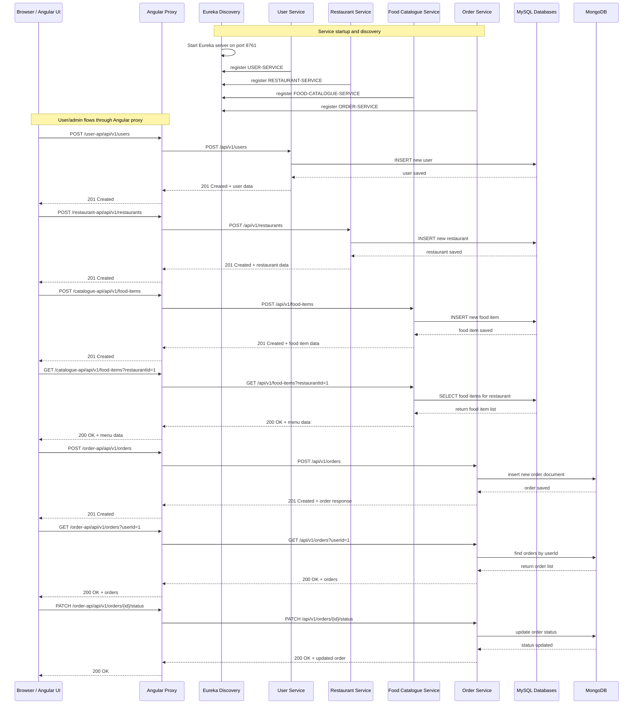

# End-to-End Sequence Diagram

This file documents the main end-to-end workflows for the Food Delivery App using a Mermaid sequence diagram.

## Participants
- Browser / Angular UI
- Angular Dev Server Proxy
- Discovery Server / Eureka
- User Service
- Restaurant Service
- Food Catalogue Service
- Order Service
- MySQL Databases
- MongoDB

## Sequence flows

## Notes
- The Angular UI uses `proxy.conf.json` to forward `/user-api`, `/restaurant-api`, `/catalogue-api`, and `/order-api` to the respective backend services.
- The backend services register with Eureka for dynamic discovery, but the current UI uses fixed proxy routes instead of direct service discovery.
- MySQL stores user, restaurant, and food catalogue data.
- MongoDB stores order documents for the order-service.
